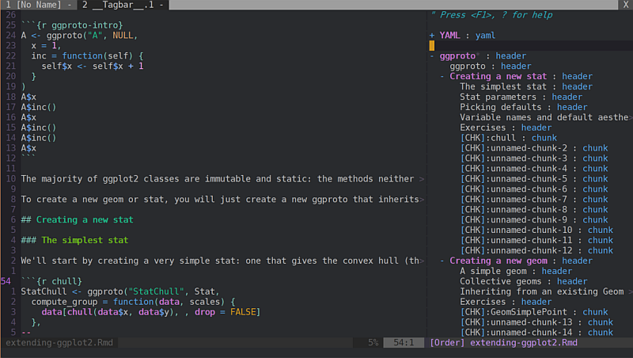

# rmd2ctags

A simple R script to extract Rmarkdown tags to be used with
[tagbar](https://github.com/majutsushi/tagbar/).

## Screenshots



## Dependencies

- R (and data.table, stringr package)
- [tagbar](https://github.com/majutsushi/tagbar/)

## Usage

1. First, install [tagbar](https://github.com/majutsushi/tagbar/)

2. Make sure `Rscript` is in your path

3. Clone this repo or just download `rmd2ctags.R` (and also `rmd2ctags.bat` if you are using Windows)

3. And add this to your .vimrc:

  ```vim
  let g:tagbar_type_rmd = {
        \   'ctagstype':'rmd',
        \   'ctagsbin': 'path/to/rmd2ctags.R',
        \   'ctagsargs':'',
        \   'kinds':['y:yaml:1', 'h:header', 'c:chunk'],
        \   'sro':'&&&',
        \   'kind2scope':{'y':'yaml', 'h':'header', 'c':'chunk'},
        \   'sort':0
        \ }
  ```

  If you are using Windows, change `ctagsbin` to the path of `rmd2ctags.bat`.

4. In vim, run `:TagbarToggle`.

## License

GPL v3

## Maintainer

Hongyuan Jia (<hongyuanjia@cqu.edu.cn>)
